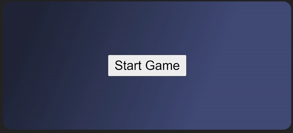
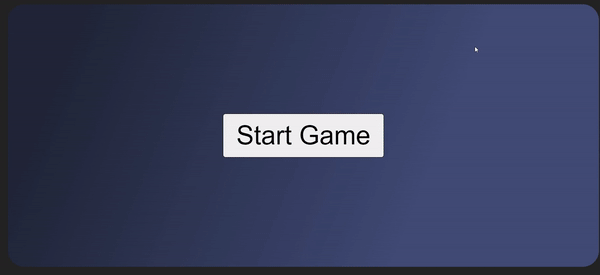

# 08-Memory-Game

Memory Game in javascript and typescript.

If you're interested, you can download the repository and open it in your code editor.
Then, run the following commands: `npm i`, and `npm start`, then open (http://localhost:3000/).

---

## Preview

### Game 1 winning

---

### Game 2 giving up

